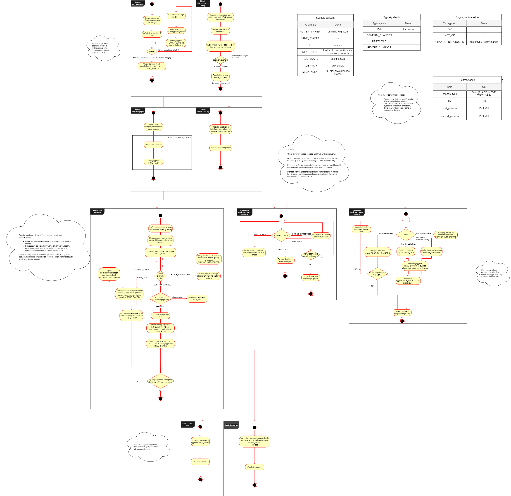

# Rummikub game

## Authors:
- [Kacper Słoniec](https://github.com/Kasl0)
- [Gracjan Filipek](https://github.com/Strattoss)

## Project goal
Rummikub is a game written for the Python Programming course. The goal of the project was to create game logic, gui and a websocket-based communication interface so that players could play from **multiple devices simultaneously seeing everyone's moves in real time**. The game was developed entirely in Python, using the [Arcade](https://api.arcade.academy/en/latest/) graphics library.

## Project schedule
1. Game logic, verification of correctness of moves, pool of available tiles and their drawing
2. Server with the necessary functionality, communication with the client
3. Creation of a working Arcade window: board, tiles, moving tiles, simple interface 
4. Improvements to the whole: undo changes, jokers and others

## Detailed game [Activity Diagram](https://github.com/Kasl0/Rummikub/tree/master/diagrams)

## Some screenshots
### Game lobby

### Incorrect move

### Game running on multiple devices simultaneously

